<h1 align="center">
  <a href="https://github.com/micycle1/PeasyGradients">
  </a><br>
PeasyGradients
<br></br>
</h1>
<p align="center">🚧<em>~~A Work in Progress~~</em>🚧</p>


*PeasyGradients* is a library for [Processing](https://processing.org/) that makes drawing color gradients easy-peasy. This library was inspired by Jeremy Behreandt's [*Color Gradients in Processing*](https://medium.com/@behreajj/color-gradients-in-processing-v-2-0-e5c0b87cdfd2) but has greatly developed the concepts and functionality presented there.

This `README` provides an overview of the library — read it to get a good idea of what the library is capable of and how to use it. Access examples (Processing sketches) [here](); access documentation (online Javadocs) [here]().

## Overview

### Key Features:
* ### 10 Gradient Types
* ### 10 Color Spaces
* ### 13 Color Interpolation Functions
* ### Fast!

### Creating a 1D gradient

The `PeasyGradients` class renders 1D `Gradients` as 2D spectrums in your Processing sketch. A 1D `Gradient` consists solely of color stops — these define the colors and the discrete position (percentage) each color occurs at on the 1D axis.

A simple black-to-white gradient is created as such:

```
Gradient blackToWhite = new Gradient(color(0), color(255));
```

Here, `blackToWhite` is a 1D gradient with two equidistant color stops — black is at *0.00*, and white is at *1.00*.

### Rendering a 2D gradient
Merely instantiating a 1D gradient doesn't draw anything. How should this 1D spectrum be drawn? Do we want to render a black-to-white linear gradient? A radial gradient? Or something else? This is where the *PeasyGradients* class comes in... We pass a `Gradient` (here, the `blackToWhite` 1D gradient) to one of a variety of methods to draw a 2D gradient.

```
PeasyGradients peasyGradients;

void setup() {
    peasyGradients = new PeasyGradients(this);
}

void draw() {
    peasyGradients.linearGradient(blackToWhite, 0); // angle = 0 (horizontal)
}
```

That's it! Now a horizontal black-to-white linear gradient will be drawn in the sketch (by default, the library draws directly into the sketch; you can give it a specific `PGraphics` pane to draw into with the `.setRenderTarget()` method).

See the *Gradients* section below for a showcase of each (2D) gradient type.

## Installation

* To use PeasyGradients in a Java IDE, simply download the most recent .jar from [releases](https://github.com/micycle1/PeasyGradients/releases/) and include it in your project's classpath.

* To use it in the Processing IDE (for it to appear in the contribution manager), download the .jar as above and then see [this](https://github.com/processing/processing/wiki/How-to-Install-a-Contributed-Library).

## Gradients

PeasyGradients provides methods to render 10 types of 2D gradients.

Zoom and rotation can be adjusted for most gradient types; certain gradient types offer additional parameters — for example, the polygon gradient requires a parameter specifying the number of polygon sides.

Each gradient type is shown below. The screenshots are taken using the `LUV` color space with `SMOOTH_STEP` interpolation, and rotation set to 0 where applicable.

| **Linear**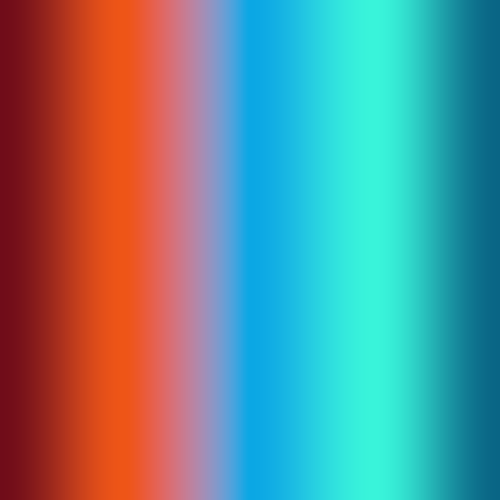 | **Radial** |
|:---:|:---:|
| **Conic**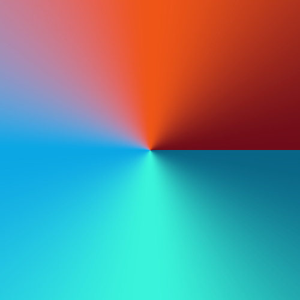 | **Spiral**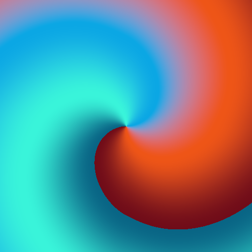 |
| **Diamond** | **Cross** |
| **Polygon**.png) | **Hourglass**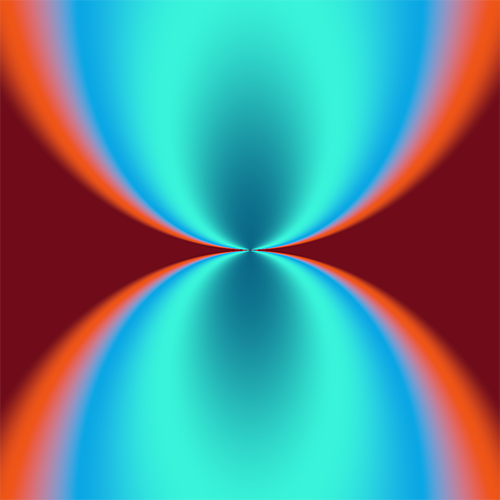 |
| **Noise** |


## Interpolation: Easing Functions
In the parts of a `Gradient` between color stops, colors are composed via interpolating the neighbouring two color stops. Easing functions affect how these two adjacent stops contribute to each point between them.

For example, with *linear* interpolation, a point in a `Gradient` which is midway between 2 color stops is composed of 50% of the first color and 50% of the second color — there is a linear relationship between its position and the weighting of color it receives from each color stop. Other easing functions are non-linear (for example a point closer to one color stop may in some cases receive more color from the second color stop) which can result in more interesting gradients.
 
Certain easing functions suit some gradient types better than others — for example, the `BOUNCE` function works well with polygon gradients but rather more poorly with linear gradients. Therefore, as with color spaces, experimentation with different interpolation functions is encouraged.

Set the interpolation (easing) function for a given `Gradient` with `.setInterpolationMode()`, like so:

```
myGradient.setInterpolationMode(Interpolation.SMOOTH_STEP);
```

See for a comparison of all available easing functions modes in expandable section below:

<details><summary style="font-size:135%; color:blue">💥See Interpolation Comparison...</summary>

| **Linear** | **Identity** |
|:---:|:--:|
| **Smooth Step** | **Smoother Step** |
| **Exponential** | **Cubic** |
| **Circular** | **Bounce** |
| **Sine**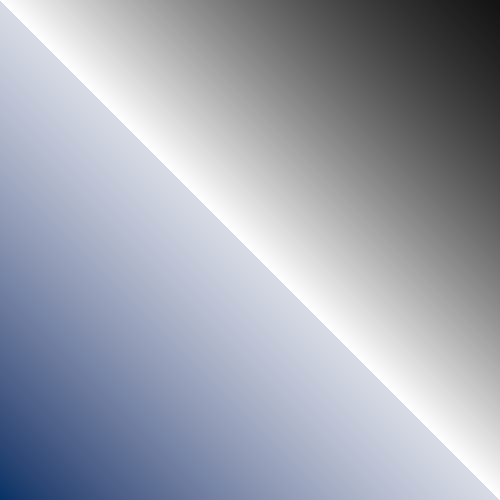 | **Parabola**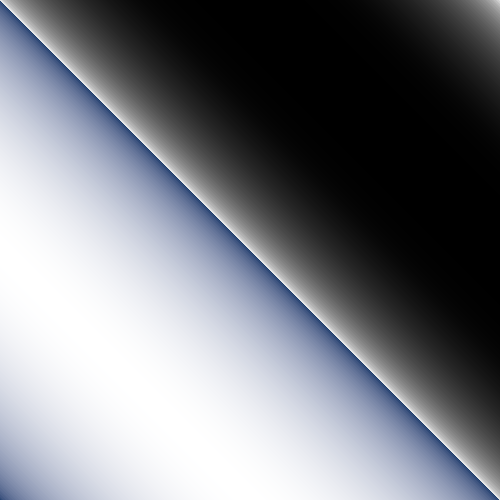 |
| **Gain 1**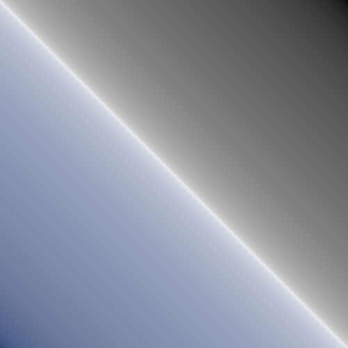 | **Gain 2** |
| **Exponential Impulse**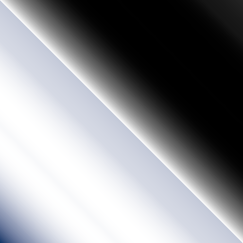 |

</details>

## Color Spaces

Color spaces define how the color value at each color stop is represented.

Remember that a 1D `Gradient` consists of only a few defined color stops; all other colors in a `Gradient`'s spectrum are **composed** by **interpolating** between any two adjacent color stops. Representing color stops differently (in different color spaces) affects the results of interpolation, and this can have a noticeable effect on the overall spectrum of a gradient (so experimentation with different color spaces is encouraged). A rule of thumb: avoid the `RGB`, `RYB` and `HSB` color spaces as they don't interpolate luminosity well.


 Set the color space for a given `Gradient` with `.setColorSpace()`, like so:
 
 ```
 myGradient.setColorSpace(ColorSpaces.RGB);
 ```

 PeasyGradients supports many different color spaces — all possible color spaces are accessible via `ColorSpaces.class` and examples of each are shown in the expandable section below:

<details><summary style="font-size:135%; color:blue">💥See Color Space Comparison...</summary>

| **RGB**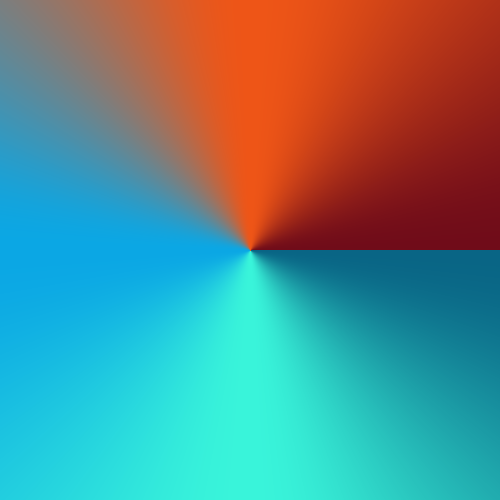 | **RYB**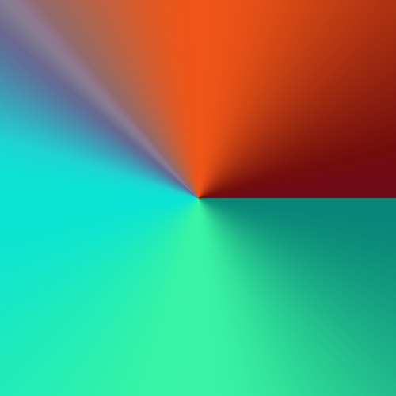 |
|:---:|:---:|
| **HSB**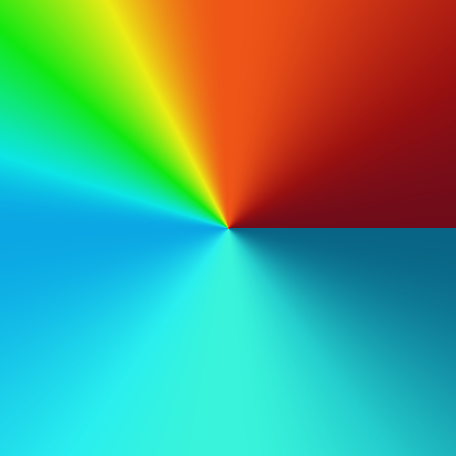 | **XYZ (CIE 1931)**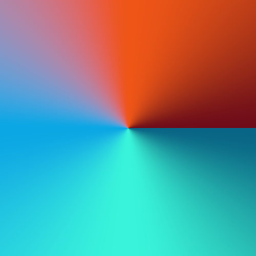 |
| **LAB (CIE L\*a\*b\*)**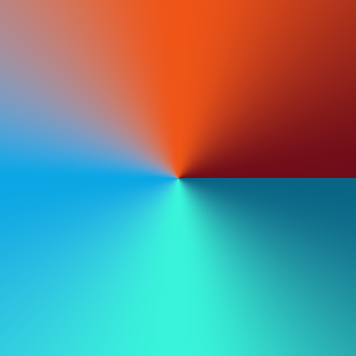 | **HLAB (Hunter LAB)**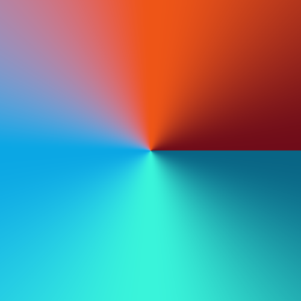 |
| **DIN99**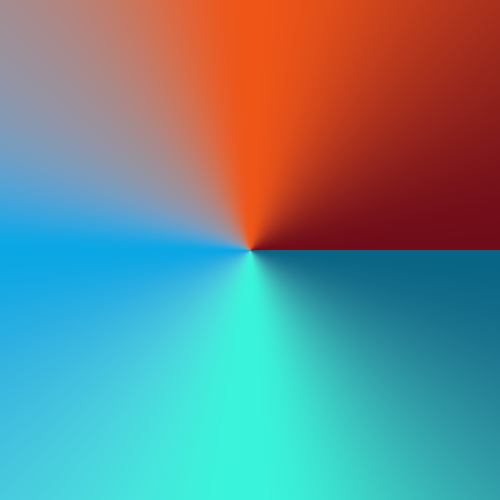 | **ITP (ICtCp)**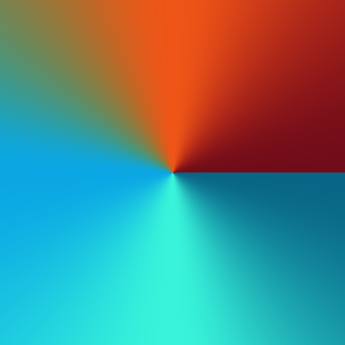 |
| **LUV (CIE 1976 L\*, u\*, v\*)** | **JAB (JzAzBz)**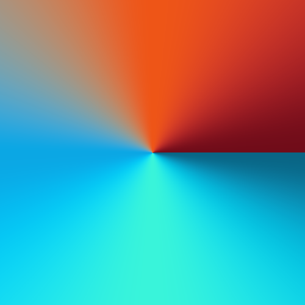 |

</details>

## Animating Gradients

### Animating Color Offset

The position of all color stops within a `Gradient` can be offset using `.setOffset(amount)`.

Furthermore, the `.animate(amount)` method changes this offset by the given `amount` each time it is called; with this you can create an gradient spectrum scrolling effect by calling `.animate(0.01f)` each frame for example.

### Priming a Gradient for Animation

Naively animating a gradient may lead to an ugly and undesirable seam in the gradient where the first and last color stops (at positions 0.00 and 1.00 respectively) bump right up against each other, like in the linear gradient below:

<p align="center"><a href="https://github.com/micycle1/PeasyGradients">
</a><br></p>

To avoid this, call `.primeAnimation()` on a `Gradient` (once) before animating it. This pushes a copy of the first color stop of the `Gradient` to its end (scaling all other color stops accordingly), to produce a **seamless gradient spectrum**, regardless of offset.

<p align="center"><a href="https://github.com/micycle1/PeasyGradients">
</a><br></p>

Calling `.primeAnimation()` on a `Gradient` before rendering it as a **conic** or **spiral** gradient has the added benefit of smoothing the transition between the first and last colors, regardless of whether you wish to animate the gradient, as below:

<p align="center"><a href="https://github.com/micycle1/PeasyGradients">
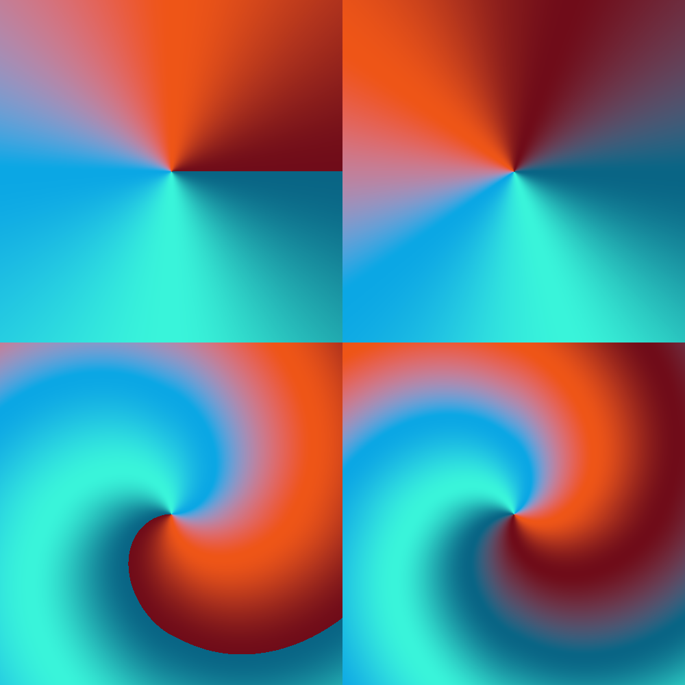</a><br></p>

### Animating Color

The **color** of `Colorstop`s within a `Gradient` can be modified after the `Gradient` has been instantiated.

Set the color of a specific color stop with `.setColorStopCol()`, shown below:

```
angle += PI / 180; // increment angle

colorMode(HSB, 360, 100, 100); // switch Processing to HSB mode to set hue more easily

myGradient.setColorStopCol(0, color(frameCount % 360, 100, 100)); // set color stop at index 0
myGradient.setColorStopCol(1, color((frameCount + 180) % 360, 100, 100)); // set color stop at index 1

peasyGradients.linearGradient(myGradient, angle); // render gradient
```

<p align="center"><a href="https://github.com/micycle1/PeasyGradients">
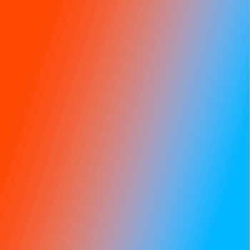</a><br></p>

### Animating Color Stop Position

The **position** of `Colorstop`s within a `Gradient` can also be modified after the `Gradient` has been instantiated.

Set the position (0...1.0) of a specific color stop with `.setColorStopPosition()`, shown below:

```
myGradient.setColorStopPosition(1, map(mouseX, 0, width, 0, 1)); // set position of middle color (index = 1)

peasyGradients.linearGradient(myGradient, 0);
```

<p align="center"><a href="https://github.com/micycle1/PeasyGradients">
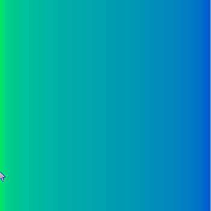</a><br></p>

## Other Stuff

### Posterisation

Use posterisation to define the maximum number of colors the PeasyGradient renderer uses to render `Gradients`. Smaller numbers are more restrictive and increase the color banding effect — there may be times when this artistic effect is desirable.

```
peasyGradients.posterise(10); // renderer will now render gradients with 10 colors at most 
```

| **No Posterisation (default)**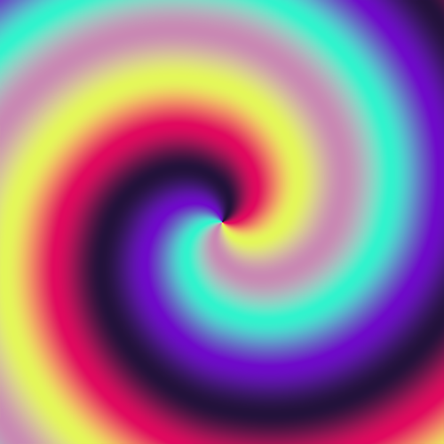 | **Posterisation = 10**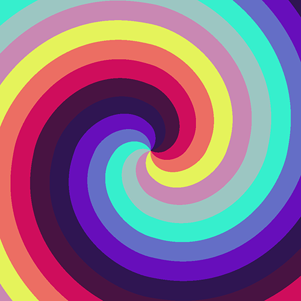 |  **Posterisation = 25**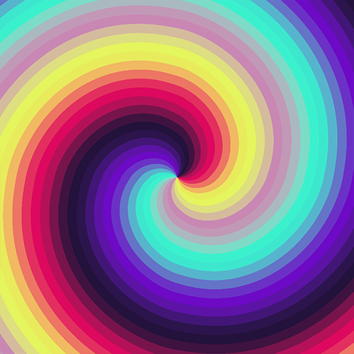 |
|:---:|:---:|:---:|

Use `.clearPosterisation()` to clear any posterisation setting and render gradients with full color.


### Generating Random Gradients

The `Palette` class provides some helper methods for generating (random) `Gradient` color palettes.

```
randomGradient = new Gradient(Palette.complementary()); // two random colors that are on opposite sides of the color wheel
randomGradient = new Gradient(Palette.triadic()); // 3 random colors that are evenly spaced on the color wheel
randomGradient = new Gradient(Palette.tetradic()); // 4 random colors that are evenly spaced on the color wheel
randomGradient = new Gradient(Palette.randomcolors(7)); // N random colors distributed according to the golden ratio
randomGradient = new Gradient(Palette.randomRandomcolors(8)); // N random colors also distributed randomly
```

### Masking

Strictly speaking, this functionality isn't defined by PeasyGradients (rather, it's defined by Processing itself). But I think it's worthwhile to show how masking can be used in conjunction with PeasyGradients. An example which uses text ("P") to mask a gradient is provided below:

```
void setup() {

  gradientLayer = createGraphics(WIDTH, HEIGHT); // PGraphics layer containing gradient
  textLayer = createGraphics(WIDTH, HEIGHT); //  PGraphics layer containing text (used as alpha mask)

  peasyGradients = new PeasyGradients(this);

  textLayer.beginDraw();
  textLayer.fill(255); // set to white to set pixels to keep during alpha mask
  textLayer.textSize(150);
  textLayer.textAlign(CENTER, CENTER);
  textLayer.text("N", width / 2, height / 2 - textLayer.textDescent() / 2); // draw text in image center
  textLayer.endDraw();
}

void draw() {

  PVector mousePos = new PVector(mouseX, mouseY);

  background(0);
  
  // render gradient into PGraphics layer
  peasyGradients.setRenderTarget(gradientLayer);
  peasyGradients.spiralGradient(gradient, mousePos, map(mouseY, 0, height, 0.5f, PI * 6), 2);

  gradientLayer.mask(textLayer.get()); // mask gradient layer using text (keep only the text)

  image(gradientLayer, 0, 0); // draw (now masked) gradient image
}
```

<p align="center"><a href="https://github.com/micycle1/PeasyGradients">
</a><br></p>

## Library Optimisation
PeasyGradients targets the **CPU** (as opposed to the GPU) as to not be dependent on `OPENGL` libraries. To this end, there have been many internal optimisations to make the library suitable for dynamic animation and interaction rather than just static rendering. Rendering (most) gradients at 60fps at 1080p is more than achievable on modern processors.

## Known Issues

Known bugs, shortcomings or other issues.

* Gamut out of range on LAB etc for some (high value) colours.

## Improvements

* Implement [four-corner](https://graphicdesign.stackexchange.com/questions/19477/4-colors-corners-gradient-with-illustrator-or-photoshop) gradients (or a more general form which distributes *N* by placing colors around the edge, interpolating towards the middle)
* Implement [this](https://www.filterforge.com/wiki/index.php/Spiral_Gradient) type of spiral gradient