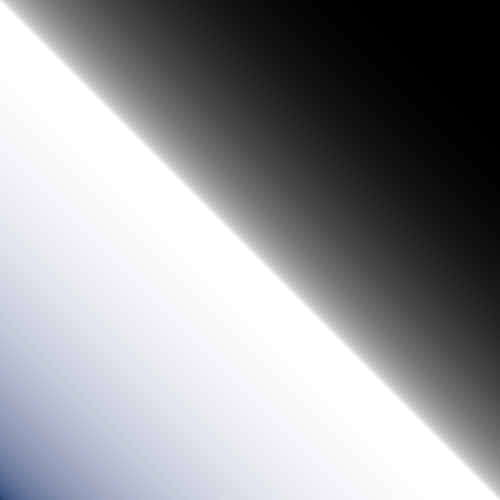
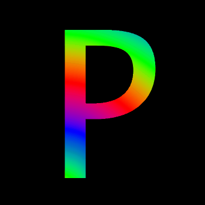

[](https://jitpack.io/#micycle1/PeasyGradients)
 [](https://sonarcloud.io/summary/new_code?id=micycle1_PeasyGradients)

<h1 align="center">
  <a href="https://github.com/micycle1/PeasyGradients">
  </a>
</h1>

# PeasyGradients
A Processing library for creating and rendering color gradients.

### Key Features
* 11 Types of 2D Gradients
* 13 Color Spaces
* 14 Color Interpolation Functions
* Fast!

_This `README` provides an overview of the library — what it's capable of and how to use it. Access examples (Processing sketches) [here](https://github.com/micycle1/PeasyGradients/tree/master/examples); access documentation (online Javadocs) [here](https://micycle1.github.io/PeasyGradients/)._

## Core Concepts

PeasyGradients operates on two distinct levels:

1. **Gradient Definition (1D)**: A mathematical function that maps positions along a single axis [0,1] to colors. Think of it as a recipe for color transitions.
   - Defined by color stops (color + position pairs)
   - Specifies interpolation method (how colors blend)
   - Sets color space for calculations

2. **Gradient Rendering (2D)**: The process of sampling the 1D gradient definition to create a 2D visualization
   - Different sampling patterns (linear, radial, conic)
   - Controls for position, angle, and spread
   - Direct output to Processing sketches

## Quick Start

```java
// 1. Define your 1D gradient
Gradient blackToWhite = new Gradient(color(0), color(255));
// This creates the mathematical definition: position 0.0 = black, position 1.0 = white

// 2. Create the renderer
PeasyGradients renderer = new PeasyGradients(this);

// 3. Render the gradient using different sampling patterns
// renders into the Processing sketch by default
renderer.linearGradient(blackToWhite, 0);  // as a horizontal fill
renderer.radialGradient(blackToWhite, width/2, height/2, 200);  // As a circular gradient
```

See the *Gradients* section below for a showcase of each (2D) gradient type.

## Installation

<details><summary>Processing IDE — Quick</summary>
<p>

Download the latest *peasyGradients.jar* from [releases](https://github.com/micycle1/PeasyGradients/releases/) and simply drag-and-drop it onto the [Processing IDE](https://processing.org/reference/environment/).
</p>
</details>

<details><summary>Processing IDE — Permanently</summary>
<p>

Download the latest *peasyGradients.jar* from [releases](https://github.com/micycle1/PeasyGradients/releases/) and save it to `Documents\Processing\libraries\peasyGradients\library`.

Result: `Documents\Processing\libraries\peasyGradients\library\peasyGradients.jar`.

(Note the *.jar* and the folder **must** be called `peasyGradients` — rename the .jar if this is not the case).
</p>
</details>

<details><summary>Maven/Gradle</summary>
<p>

PeasyGradients is hosted as an artifact for use in Maven or Gradle projects via [Jitpack](https://jitpack.io/#micycle1/PeasyGradients) — follow the instructions there (very easy). 
</p>
</details>

## Gradients

PeasyGradients provides methods to render 11 types of 2D gradients.

Each gradient type is shown below. The screenshots are taken using the `LUV` color space with `SMOOTH_STEP` interpolation, and rotation set to 0 where applicable.

| **Linear** | **Radial** | **Conic** |
|:---:|:---:|:---:|
| **Spiral** | **Diamond** | **Cross** |
| **Polygon (n-sided)**.png) | **Hourglass** | **Spotlight** |
| **Fractal Noise** | **Noise** |  

_Zoom and rotation can be adjusted for most gradient types; certain gradient types offer additional parameters — for example, the polygon gradient requires a parameter specifying the number of polygon sides._

_For many of the gradient types, there are multiple methods available to call, offering varying degrees of customisation of the gradient's spectrum shape._


## Color Interpolation

In 1D gradients, colors between stops are calculated by interpolating between adjacent stop colors. The interpolation/easing function controls how colors blend:

- **Linear**: Colors blend evenly based on position (50% position = 50% of each color)
- **Non-linear**: Colors blend with varying weights, creating more dynamic transitions

```java
// Set interpolation mode
gradient.setInterpolationMode(Interpolation.SMOOTH_STEP);
```

Different interpolation modes suit different rendering patterns. For example, `BOUNCE` works well with polygon gradients but can appear jarring in linear gradients. Experiment with different modes to achieve desired effects.

Here's a comparison between all available interpolation modes:

<table>
  <tr>
    <td align="center" valign="center"><b>Linear</b></td>
    <td align="center" valign="center"><b>Identity</b></td>
    <td align="center" valign="center"><b>Smooth Step</b></td>
    <td align="center" valign="center"><b>Smoother Step</b></td>
  </tr>
  <tr>
    <td valign="top" width="25%"></td>
    <td valign="top" width="25%"></td>
    <td valign="top" width="25%"></td>
    <td valign="top" width="25%"></td>
  </tr>
  <tr>
    <td align="center" valign="center"><b>Exponential</b></td>
    <td align="center" valign="center"><b>Cubic</b></td>
    <td align="center" valign="center"><b>Circular</b></td>
    <td align="center" valign="center"><b>Bounce</b></td>
  </tr>
  <tr>
    <td valign="top" width="25%"></td>
    <td valign="top" width="25%"></td>
    <td valign="top" width="25%"></td>
    <td valign="top" width="25%"></td>
  </tr>
  <tr>
    <td align="center" valign="center"><b>Sine</b></td>
    <td align="center" valign="center"><b>Parabola</b></td>
    <td align="center" valign="center"><b>Gain 1</b></td>
    <td align="center" valign="center"><b>Gain 2</b></td>
  </tr>
  <tr>
    <td valign="top" width="25%"></td>
    <td valign="top" width="25%"></td>
    <td valign="top" width="25%"></td>
    <td valign="top" width="25%"></td>
  </tr>
  <tr>
    <td align="center" valign="center"><b>Exponential Impulse</b></td>
    <td align="center" valign="center"><b>Heartbeat</b></td>
    <td align="center" valign="center"></td>
    <td align="center" valign="center"></td>
  </tr>
  <tr>
    <td valign="top" width="25%"></td>
    <td valign="top" width="25%"></td>
    <td valign="top" width="25%"></td>
    <td valign="top" width="25%"></td>
  </tr>
</table>

</details>

## Color Spaces

Color space determines how colors are numerically represented, and this affects how colors blend during interpolation. Different color spaces can produce noticeably different gradients even with the same color stops.

<b> main comparison is perceptually uniform vs not!</b>
  ideally uniform hue perception and 

  A smooth transition using a model designed to mimic human perception of color. The blending is done so that the perceived brightness and color varies smoothly and evenly.


```java
gradient.setColorSpace(ColorSpace.LAB);  // Perceptually uniform blending
```

For smooth, perceptually uniform gradients, prefer spaces like `OKLAB`, `ITP`, or `K_MUNK` over `RGB`, `RYB`, or `HSB`. This is because the latter don't maintain consistent perceived brightness during interpolation.

All available spaces are accessible via `ColorSpace.class` and demonstration of each are shown in the expandable section below:

*Note that with the chosen gradient, the spectrum differences aren't too apparent between many of the colorspaces in the images below. Other gradients (i.e. using different colors) may exhibit more substantial differences between the different colorspaces.*

| **RGB** | **RYB** |
|:---:|:---:|
| **HSB** | **XYZ (CIE 1931)** |
| **LAB (CIE L\*a\*b\*)** | **HLAB (Hunter LAB)** |
| **DLAB** | **ITP (ICtCp)** |
| **LUV (CIE 1976 L\*, u\*, v\*)** | **JAB (JzAzBz)** |
| **XYB** | **IPT**

</details>

## Animating Gradients

### Animating Color Offset

The position of all color stops within a `Gradient` can be offset using `.setOffset(amount)`.

Furthermore, the `.animate(amount)` method changes this offset by the given `amount` each time it is called; with this you can create an gradient spectrum scrolling effect by calling `.animate(0.01f)` each frame for example.

### Priming a Gradient for Animation

Naively animating a gradient may lead to an ugly and undesirable seam in the gradient where the first and last color stops (at positions 0.00 and 1.00 respectively) bump right up against each other, like in the linear gradient below:

<p align="center"><a href="https://github.com/micycle1/PeasyGradients">
</a><br></p>

To avoid this, call `.primeAnimation()` on a `Gradient` (once) before animating it. This pushes a copy of the first color stop of the `Gradient` to its end (scaling all other color stops accordingly), to ensure a **seamless gradient spectrum**, regardless of offset.

<p align="center"><a href="https://github.com/micycle1/PeasyGradients">
</a><br></p>

Calling `.primeAnimation()` on a `Gradient` before rendering it as a **conic** or **spiral** gradient has the added benefit of smoothing the transition between the first and last colors, regardless of whether you wish to animate the gradient, as below:

<p align="center"><a href="https://github.com/micycle1/PeasyGradients">
</a><br></p>

### Animating Color

The **color** of `Colorstop`s within a `Gradient` can be modified after the `Gradient` has been instantiated.

Set the color of a specific color stop with `.setStopColor()`, shown below:

```
angle += PI / 180; // increment angle

colorMode(HSB, 360, 100, 100); // switch Processing to HSB mode to set hue more easily

myGradient.setStopColor(0, color(frameCount % 360, 100, 100)); // set color stop at index 0
myGradient.setStopColor(1, color((frameCount + 180) % 360, 100, 100)); // set color stop at index 1

peasyGradients.linearGradient(myGradient, angle); // render gradient
```

<p align="center"><a href="https://github.com/micycle1/PeasyGradients">
</a><br></p>

### Animating Color Stop Position

The **position** of `Colorstop`s within a `Gradient` can also be modified after the `Gradient` has been instantiated.

Set the position (0...1.0) of a specific color stop with `.setStopPosition()`, shown below:

```
myGradient.setStopPosition(1, map(mouseX, 0, width, 0, 1)); // set position of middle color (index = 1)

peasyGradients.linearGradient(myGradient, 0);
```

<p align="center"><a href="https://github.com/micycle1/PeasyGradients">
</a><br></p>

## Other Stuff

### Posterisation

Use posterisation to define the maximum number of colors the PeasyGradient renderer uses to render `Gradients`. Smaller numbers are more restrictive and increase the color banding effect — there may be times when this artistic effect is desirable.

```
peasyGradients.posterise(10); // renderer will now render gradients with 10 colors at most 
```

| **No Posterisation (default)** | **Posterisation = 10** |  **Posterisation = 25** |
|:---:|:---:|:---:|

Use `.clearPosterisation()` to clear any posterisation setting and render gradients with in full color.


### Generating Random Gradients

The `Palette` class provides some helper methods for generating random `Gradient` color palettes.

Note this palette generation is not entirely random -- the class produces gradients spectrums that are more aesthetic than what a truly random method would generate.

```
randomGradient = new Gradient(Palette.complementary()); // two random colors that are on opposite sides of the color wheel
randomGradient = new Gradient(Palette.triadic()); // 3 random colors that are evenly spaced on the color wheel
randomGradient = new Gradient(Palette.tetradic()); // 4 random colors that are evenly spaced on the color wheel
randomGradient = new Gradient(Palette.randomcolors(7)); // N random colors with hue distributed according to the golden ratio
randomGradient = new Gradient(Palette.randomRandomcolors(8)); // N random colors also distributed randomly
```

### Masking

Strictly speaking, this functionality isn't defined by PeasyGradients (rather, it's defined by Processing itself). But I think it's worthwhile to show how masking can be used in conjunction with PeasyGradients. An example which uses text ("P") to mask a spiral gradient is provided below:

<details><summary>💥See Code Example...</summary>

```
void setup() {

  gradientLayer = createGraphics(WIDTH, HEIGHT); // PGraphics layer containing gradient
  textLayer = createGraphics(WIDTH, HEIGHT); //  PGraphics layer containing text (used as alpha mask)

  peasyGradients = new PeasyGradients(this);

  textLayer.beginDraw();
  textLayer.fill(255); // set to white to set pixels to keep during alpha mask
  textLayer.textSize(150);
  textLayer.textAlign(CENTER, CENTER);
  textLayer.text("N", width / 2, height / 2 - textLayer.textDescent() / 2); // draw text in image center
  textLayer.endDraw();
}

void draw() {

  PVector mousePos = new PVector(mouseX, mouseY);

  background(0);
  
  // render gradient into PGraphics layer
  peasyGradients.setRenderTarget(gradientLayer);
  peasyGradients.spiralGradient(gradient, mousePos, map(mouseY, 0, height, 0.5f, PI * 6), 2); // map spiral rotation to mouse position
  gradientLayer.mask(textLayer.get()); // mask gradient layer using text (keep only the text)

  image(gradientLayer, 0, 0); // draw (now masked) gradient image
}
```

</details>

<p align="center"><a href="https://github.com/micycle1/PeasyGradients">
</a><br></p>

## **Library Optimisation**
PeasyGradients targets the **CPU** (as opposed to the GPU) as to not be dependent on `OPENGL` libraries. To this end, there have been many internal optimisations to make the library suitable for dynamic animation and interaction rather than just static rendering. Care was taken to optimise color interpolation and gradient rasterization, and finally multithreading was added to naively parallelise the workload. Therefore, rendering (most) gradients at 60fps at high resolutions (1080p+) is more than achievable on modern processors.

## **Improvements**

* Implement [four-corner](https://graphicdesign.stackexchange.com/questions/19477/4-colors-corners-gradient-with-illustrator-or-photoshop) gradients (or a more general form which distributes *N* colors, placing them around the edge and interpolating towards the middle).
* Implement [this](https://www.filterforge.com/wiki/index.php/Spiral_Gradient) type of spiral gradient.
* Allow easing functions to be passed in to render methods to affect the curve of whole spectrum not just the curve between each successive pair of color stops.
* Add preset color scales (rainbow, warm, cool, etc.) to `Palettes`.
* Add a gradient [contour plot](https://observablehq.com/@rreusser/locally-scaled-domain-coloring-part-1-contour-plots) overlay feature.
* Implement the CAM16/CAM16‐UCS Color Appearance Model as a colorspace.
