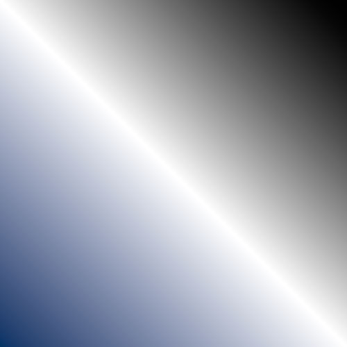

<h1 align="center">
  <a href="https://github.com/micycle1/PeasyGradients">
  </a><br>
PeasyGradients
<br></br>
</h1>
<p align="center">🚧<em>~~A Work in Progress~~</em>🚧</p>


PeasyGradients is a library for Processing to make drawing colour gradients easy-peasy. This library was inspired by Jeremy Behreandt's [*Color Gradients in Processing*](https://medium.com/@behreajj/color-gradients-in-processing-v-2-0-e5c0b87cdfd2) but has greatly developed the concepts and functionality presented there.

## Overview

### Key Features:
* ### 10 Gradient Types
* ### 10 Colour Spaces
* ### 13 Colour Interpolation functions
* ### Fast!

By default, the library draws directly into the sketch; you can give it a specific `PGraphics` pane to draw into with the `.setRenderTarget()` method.

### Creating a 1D gradient

The `PeasyGradients` class renders 1D `Gradients` as 2D images in your Processing sketch. A 1D `Gradient` consists solely of colour stops — these define the colours and the discrete position (percentage) each colour occurs at on the 1D axis.

A simple black-to-white gradient is created as such:

```
Gradient blackToWhite = new Gradient(colour(0), colour(255));
```

Here, `blackToWhite` is a 1D gradient with two equidistant colour stops — black is at *0.00*, and white is at *1.00*.

### Rendering a 2D gradient
Merely instantiating a 1D gradient doesn't draw anything. How should this 1D spectrum be drawn? Do we want to render a black-to-white linear gradient? A black-to-white radial gradient? Or something else? This is where the *PeasyGradients* class comes in. We pass a `Gradient` (here, the `blackToWhite` 1D gradient) to one of a variety of methods to draw a 2D gradient.

```
PeasyGradients peasyGradients;


void setup() {
    peasyGradients = new PeasyGradients(this);
}

void draw() {
    peasyGradients.linearGradient(blackToWhite, 0); // angle = 0 (horizontal)
}
```

That's it! Now a horizontal black-to-white linear gradient will be drawn in the sketch. See the *Gradients* section below for more information about each (2D) gradient type.


## Installation

* To use PeasyGradients in a Java IDE, simply download the most recent .jar from [releases](https://github.com/micycle1/PeasyGradients/releases/) and include it in your project's classpath.

* To use it in the Processing IDE (for it to appear in the contribution manager), download the .jar as above and then see [this](https://github.com/processing/processing/wiki/How-to-Install-a-Contributed-Library).

## Gradients

PeasyGradients provides methods to render 11 types of 2D gradients.

Zoom and rotation can be adjusted for most gradient types; certain gradient types offer additional parameters.

Screenshots and code examples for each gradient type are provided in the sub-sections below. The screenshots are taken using the `LUV` colour space with `SMOOTH_STEP` interpolation, and rotation set to 0 where applicable.

| **Linear** | **Radial** |
|:---:|:---:|
| **Conic** | **Spiral** |
| **Diamond** | **Cross** |
| **Polygon**.png) | **Hourglass** |
| **Noise** |

## Colour Spaces

Colour spaces define how the colour value at each colour stop is represented.

Remember that a 1D `Gradient` consists of only a few defined colour stops; all other colours in a `Gradient`'s spectrum are **composed** by **interpolating** between any two adjacent colour stops. Representing colour stops differently affects the results of interpolation and this can have a noticeable effect on the overall spectrum of a gradient (so experimentation with different colour spaces is encouraged). A rule of thumb: avoid the `RGB`, `RYB` and `HSB` colour spaces as they don't interpolate luminosity well.


 The colour space for a given `Gradient`  is set with `.setColSpace()`, as such:
 
 ```
 myGradient.setColSpace(ColourSpaces.RGB);
 ```

 PeasyGradients supports many different colour spaces — these are the possible colour spaces (accessible via `ColourSpaces.class`):

* `RGB`
* `RYB`
* `HSB`
* `XYZ` (CIE 1931) [**gradient default**]
* `LAB` (CIE L\*a\*b*)
* `DIN99`
* `ITP` (ICtCp)
* `HLAB` (Hunter LAB)
* `LUV` (CIE 1976 L*, u*, v*)
* `JAB` (JzAzBz)

<details><summary style="font-size:135%; color:blue">💥See Examples...</summary>

### `RGB`

<a href="https://github.com/micycle1/PeasyGradients">
</a><br>

### `RYB`

<a href="https://github.com/micycle1/PeasyGradients">
</a><br>

### `HSB`

<a href="https://github.com/micycle1/PeasyGradients">
</a><br>

### `XYZ` (CIE 1931) [**gradient default**]

<a href="https://github.com/micycle1/PeasyGradients">
</a><br>

### `LAB` (CIE L\*a\*b*)

<a href="https://github.com/micycle1/PeasyGradients">
</a><br>

### `HLAB` (Hunter LAB)

<a href="https://github.com/micycle1/PeasyGradients">
</a><br>

### `DIN99`

<a href="https://github.com/micycle1/PeasyGradients">
</a><br>

### `ITP` (ICtCp)

<a href="https://github.com/micycle1/PeasyGradients">
</a><br>

### `LUV` (CIE 1976 L*, u*, v*)

<a href="https://github.com/micycle1/PeasyGradients">
</a><br>

### `JAB` (JzAzBz)

<a href="https://github.com/micycle1/PeasyGradients">
</a><br>
</details>


## Interpolation: Easing Functions
Easing functions affect how the colours between two adjacent colour stops are composed.

For example, with *linear* interpolation, a point in a `Gradient` which is midway between 2 colour stops is composed of 50% of the first colour and 50% of the second colour — there is a linear relationship between its position and the weighting of colour it receives from each colour stop. Other easing functions are non-linear (for example a point closer to one colour stop may in some cases receive more colour from the second colour stop) which can result in more interesting gradients.
 
Certain easing functions suit some gradient types better than others — for example, the `BOUNCE` function works well with polygon gradients but rather more poorly with linear gradients. Therefore, as with colour spaces, experimentation with different interpolation functions is encouraged.

```
todo code xample
```

These are the the available interpolation easing functions in PeasyGradients (accessible via the `Interpolation` enum):

* `LINEAR`
* `IDENTITY`
* `SMOOTH_STEP` [**gradient default**]
* `SMOOTHER_STEP` (Ken Perlin’s smoother step)
* `EXPONENTIAL`
* `CUBIC`
* `BOUNCE`
* `CIRCULAR`
* `SINE`
* `PARABOLA`
* `GAIN1` (gain function with a certain constant)
* `GAIN2` (as above, but with different constant)
* `EXPIMPULSE` (Exponential Impulse)

<table>
  <tr>
<td> </td>
<td> </td>
   </tr> 
   <tr>
p
  </td>
  </tr>
</table>

<details><summary style="font-size:135%; color:blue">💥See Examples...</summary>

### `LINEAR`

<a href="https://github.com/micycle1/PeasyGradients">
</a><br>

### `RYB`

<a href="https://github.com/micycle1/PeasyGradients">
</a><br>

</details>

## Animating Gradients

### Animating Colour Stops

The position of all colour stops within a `Gradient` can be offset using `.setOffset(amount)`.

Furthermore, the `.animate(amount)` method changes this offset by the given `amount` each time it is called; with this you can animate a `Gradient`'s colour by calling `.animate(0.01f)` each frame for example.

### Priming a gradient for Animation

Naively animating a gradient may lead to an ugly and undesirable seam in the gradient where the first and last colour stops (at positions 0.00 and 1.00 respectively) bump right up against each other, like in the linear gradient below:

<a href="https://github.com/micycle1/PeasyGradients">
</a><br>

To alleviate this, call `.primeAnimation()` on a `Gradient` (once) before animating it. This pushes a copy of the first colour stop of the `Gradient` to its end (scaling all the other colour stops accordingly), to produce a seamless gradient, regardless of offset.

<a href="https://github.com/micycle1/PeasyGradients">
</a><br>

Calling `.primeAnimation()` on a `Gradient` before rendering it as a **conic** or **spiral** gradient has the added benefit of smoothing the transition between the first and last colours, regardless of whether you wish to animate the gradient, as below:

<a href="https://github.com/micycle1/PeasyGradients">
</a><br>

### Animating Colour 2

## Other Stuff

### Posterisation

Use posterisation to define the maximum number of colours a gradient uses.

## Library Optimisation
PeasyGradients targets the CPU (as opposed to the GPU) as to not be dependent on OPENGL libraries. To this end, there have been many internal optimisations to make the library suitable for dynamic animation and interaction rather than just static rendering. Rendering (most) gradients at 60fps at 1080p is more than achievable on modern processors.