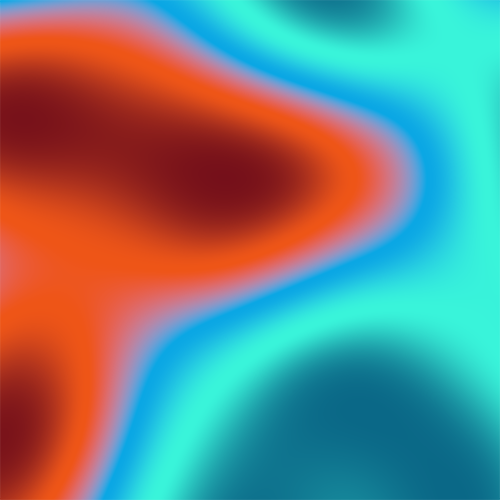

<h1 align="center">
  <a href="https://github.com/micycle1/PeasyGradients">
  </a><br>
PeasyGradients
<br></br>
</h1>
<p align="center">🚧<em>~~A Work in Progress~~</em>🚧</p>


PeasyGradients is a library for Processing to make drawing colour gradients easy-peasy. This library was inspired by Jeremy Behreandt's [*Color Gradients in Processing*](https://medium.com/@behreajj/color-gradients-in-processing-v-2-0-e5c0b87cdfd2) but has greatly developed the concepts and functionality presented there.

## Overview

### Key Features:
* ### 10 Gradient Types
* ### 10 Colour Spaces
* ### 13 Colour Interpolation functions
* ### Fast!

By default, the library draws directly into the sketch; you can give it a specific `PGraphics` pane to draw into with the `setRenderTarget()` method.

### Creating a 1D gradient

The `PeasyGradients` class renders 1D `Gradients` as 2D images in your Processing sketch. A 1D `Gradient` consists solely of colour stops — these define the colours and the position (percentage) each colour occurs at on the 1D axis.

A simple black-to-white gradient is created as such:

```
Gradient blackToWhite = new Gradient(colour(0), colour(255));
```

Here, `blackToWhite` is a 1D gradient with two equidistant colour stops — black is at *0.00*, and white is at *1.00*.

### Rendering a 2D gradient
Merely instantiating a 1D gradient doesn't draw anything. How should this 1D spectrum be drawn? Do we want to render a black-to-white linear gradient? A black-to-white radial gradient? Or something else? This is where the *PeasyGradients* class comes in. We pass a `Gradient` (here, the `blackToWhite` 1D gradient) to one of a variety of methods to draw a 2D gradient.

```
PeasyGradients peasyGradients;


void setup() {
    peasyGradients = new PeasyGradients(this);
}

void draw() {
    peasyGradients.linearGradient(blackToWhite, 0); // angle = 0 (horizontal)
}
```

That's it! Now a horizontal black-to-white linear gradient will be drawn in the sketch. See the *Gradients* section below for more information about each (2D) gradient type.


## Installation

* To use PeasyGradients in a Java IDE, simply download the most recent .jar from [releases](https://github.com/micycle1/PeasyGradients/releases/) and include it in your project's classpath.

* To use it in the Processing IDE (for it to appear in the contribution manager), download the .jar as above and then see [this](https://github.com/processing/processing/wiki/How-to-Install-a-Contributed-Library).

## Gradients

PeasyGradients provides 11 types of 2D gradients. Screenshot and examples for each gradient type are provided in the sub-sections below.

Most gradient methods allow zoom and rotation to be defined; certain gradient types might offer additional parameters.

### Linear
<a href="https://github.com/micycle1/PeasyGradients">
</a><br>
<details><summary>More...</summary>
  * `linearGradient(Gradient gradient, float angle)`
</details>

### Radial
<a href="https://github.com/micycle1/PeasyGradients">
</a><br>

### Conic
<a href="https://github.com/micycle1/PeasyGradients">
</a><br>

### Spiral
<a href="https://github.com/micycle1/PeasyGradients">
</a><br>

### Diamond
<a href="https://github.com/micycle1/PeasyGradients">
</a><br>

### Cross
<a href="https://github.com/micycle1/PeasyGradients">
</a><br>

### Polygon
<a href="https://github.com/micycle1/PeasyGradients">
</a><br>

### Cone
#### TODO

### Hourglass
<a href="https://github.com/micycle1/PeasyGradients">
</a><br>

### Noise
<a href="https://github.com/micycle1/PeasyGradients">
</a><br>
<details><summary>More...</summary>
This is slow and not suitable for live dynamic rendering.
</details>

## Colour Spaces

Remember that a 1D gradient consists of only a few defined colour stops; all other colours in a gradient's spectrum are constructed by **interpolating** between any two adjacent colour stops. Colour spaces define how the colour at each colour stop is represented and this can have a noticeable effect on how these interpolated colours are (so experimentation with different colour spaces is encouraged). A rule of thumb: avoid the `RGB`, `RYB` and `HSB` colour spaces as they don't interpolate luminosity well.


 The colour space for a given `Gradient`  is set with `setColSpace()` as such:
 
 ```
 myGradient.setColSpace(ColourSpaces.RGB);
 ```

 PeasyGradients supports many different colour spaces — these are the possible colour spaces (accessible via `ColourSpaces.class`):

* `RGB`

<a href="https://github.com/micycle1/PeasyGradients">
</a><br>

* `RYB`

<a href="https://github.com/micycle1/PeasyGradients">
</a><br>

* `HSB`

<a href="https://github.com/micycle1/PeasyGradients">
</a><br>

* `XYZ` (CIE 1931) [**gradient default**]

<a href="https://github.com/micycle1/PeasyGradients">
</a><br>

* `LAB` (CIE L\*a\*b*)

<a href="https://github.com/micycle1/PeasyGradients">
</a><br>

* `HLAB` (Hunter LAB)

<a href="https://github.com/micycle1/PeasyGradients">
</a><br>

* `DIN99`

<a href="https://github.com/micycle1/PeasyGradients">
</a><br>

* `ITP` (ICtCp)

<a href="https://github.com/micycle1/PeasyGradients">
</a><br>

* `LUV` (CIE 1976 L*, u*, v*)

<a href="https://github.com/micycle1/PeasyGradients">
</a><br>

* `JAB` (JzAzBz)

<a href="https://github.com/micycle1/PeasyGradients">
</a><br>


## Interpolation: Easing Functions
Easing functions affect the behaviour of the gradient ramp between 2 adjacent colour stops. For a given percentage between two colour stops, an easing function maps this initial percentage to another, usually in some kind of non-linear relationship; this can result in more interesting gradients.
 
Certain easing functions suit some gradient types better than others — for example, `BOUNCE` works well with polygon gradients but rather more poorly with linear gradients.

```
todo
```

These are results:

These are the the available interpolation easing functions in PeasyGradients (accessible via the `Interpolation` enum):

* `LINEAR`
* `IDENTITY`
* `SMOOTH_STEP` [**gradient default**]
* `SMOOTHER_STEP` (Ken Perlin’s smoother step)
* `EXPONENTIAL`
* `CUBIC`
* `BOUNCE`
* `CIRCULAR`
* `SINE`
* `PARABOLA`
* `GAIN1` (gain function with a certain constant)
* `GAIN2` (as above, but with different constant)
* `EXPIMPULSE` (Exponential Impulse)

## Animating Gradients

The colours in a gradient can 'move' (or be animated) by shifting the position of the all the colour stops.

Call `animate(amount)` on a 1D `Gradient` to animate the gradient by the given amount [-1...1].

Call `setOffset(amount)` to set the animation offset to a fixed amount.

### Priming a gradient for Animation

Naively animating a gradient may lead to unwanted harsh transition where the first and last colour stops bump right up against each other, as below:

To alleviate this, call the `primeAnimation()` method on the gradient (once) before animating it. This method pushes a copy of the first colour of the gradient to the end, (scaling the other colour stops), so that there is a smooth transition during all animation.

## Library Optimisation
PeasyGradients has been written to target the CPU (as opposed to the GPU) as to not be dependent on OPENGL libraries. To this end, there have been many internal optimisations to make the library suitable for dynamic animation and interaction (rather than just static rendering). Rendering (most) gradients at 60fps at 1080p is more than achievable on modern processors.